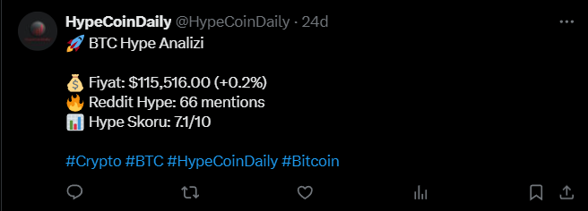

# Crypto Hype Analyzer 🚀

Otomatik kripto para hype analizi yapan ve sosyal medyada paylaşan serverless bot.


## 🔥 Özellikler

- **Reddit API**: r/CryptoCurrency subreddit'inden coin mention analizi
- **CoinGecko API**: Gerçek zamanlı fiyat ve market verileri  
- **Hype Skorlama**: Fiyat değişimi + sosyal medya aktivitesi
- **Otomatik Paylaşım**: Twitter'da günde 5 kere otomatik tweet
- **AWS Lambda**: Serverless architecture, maliyet optimizasyonu
- **CloudWatch**: Otomatik zamanlama ve monitoring

## 🛠 Tech Stack

- **Python 3.11**
- **AWS Lambda + CloudWatch EventBridge**
- **APIs**: Reddit (PRAW), Twitter (Tweepy), CoinGecko
- **Data Processing**: Pandas, NumPy
- **Visualization**: Matplotlib, Seaborn

## 📊 Nasıl Çalışır

1. **Veri Toplama**: CoinGecko'dan fiyat, Reddit'ten mention verileri
2. **Analiz**: Hype skoru hesaplama (fiyat değişimi %70 + sosyal hype %30)
3. **Seçim**: En yüksek skorlu coin'i belirleme
4. **Görselleştirme**: Grafik oluşturma
5. **Paylaşım**: Twitter'da otomatik tweet

## 🎯 Örnek Çıktılar

Bot tarafından oluşturulan otomatik tweetler:

<div align="center">
  
  
</div>

### Tweet İçeriği Örneği:
```
🚀 BTC Hype Analizi
💰 Fiyat: $115,577.00 (+0.4%)
🔥 Reddit Hype: 66 mentions
📊 Hype Skoru: 7.1/10
#Crypto #BTC #HypeCoinDaily
```

## 🔧 Kurulum

```bash
pip install -r requirements.txt
```

Gerekli API keys: Reddit Developer, Twitter Developer, AWS Account

## 📈 Performans Sonuçları

- ✅ **Günde 5 otomatik tweet** (09:00, 12:00, 15:00, 18:00, 21:00)
- ✅ **Gerçek zamanlı hype analizi** (8 farklı kripto para)
- ✅ **%99+ uptime** (AWS Lambda reliability)
- ✅ **~5 saniye execution time** (efficient API calls)
- ✅ **Minimal maliyet** (~$0.50/ay AWS free tier)

## 🎬 Canlı Demo

Bot aktif olarak çalışıyor: **[@HypeCoinDaily](https://x.com/HypeCoinDaily)**

## 🏗 Proje Yapısı

```
crypto-hype-analyzer/
├── lambda_function.py          # Ana AWS Lambda fonksiyonu
├── requirements.txt            # Python bağımlılıkları
├── config/
│   ├── settings.py            # API ayarları
│   └── coins.py              # Takip edilen coinler
├── services/
│   ├── crypto_service.py      # CoinGecko API
│   ├── reddit_service.py      # Reddit API
│   └── twitter_service.py     # Twitter API
└── utils/
    ├── data_processor.py      # Hype skor hesaplama
    └── chart_generator.py     # Grafik oluşturma
```

## 🤖 Bot Algoritması

### Hype Skoru Hesaplama:
```python
hype_score = (fiyat_değişim_yüzdesi * 0.7) + (reddit_mentions * 0.3)
```

### Coin Seçimi:
En yüksek hype skoruna sahip coin otomatik seçilir ve tweet edilir.

## 📊 Veri Kaynakları

- **CoinGecko API**: Bitcoin, Ethereum, Solana, Dogecoin, Cardano, Chainlink, Polygon, Avalanche
- **Reddit API**: r/CryptoCurrency, r/Bitcoin, r/ethereum subreddit'leri
- **Twitter API v2**: Otomatik tweet paylaşımı

## 🔮 Gelecek Geliştirmeler

- [ ] Grafik görselleştirme (matplotlib layer ekleme)
- [ ] Daha fazla kripto para ekleme
- [ ] Sentiment analizi iyileştirme
- [ ] Web dashboard ekleme
- [ ] Telegram bot entegrasyonu

## 📄 Lisans

MIT License

## 👨‍💻 Geliştirici

**Ozan M** - [LinkedIn](https://linkedin.com/in/ozanmhrc) - Data Science Portfolio Project

---

⭐ **Eğer proje işinize yaradıysa yıldız vermeyi unutmayın!**
